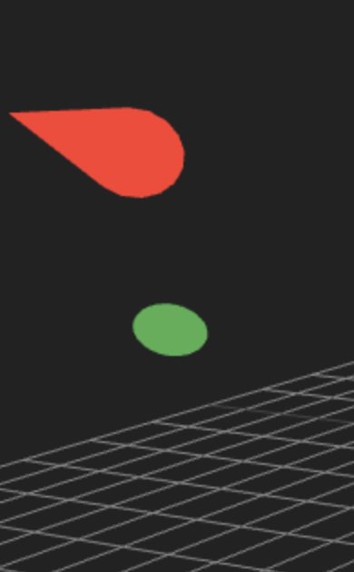
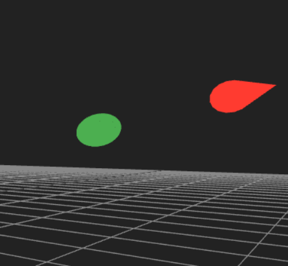
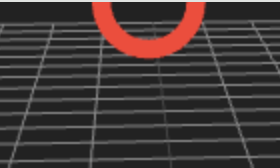
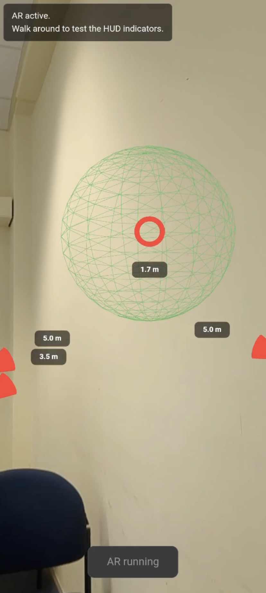
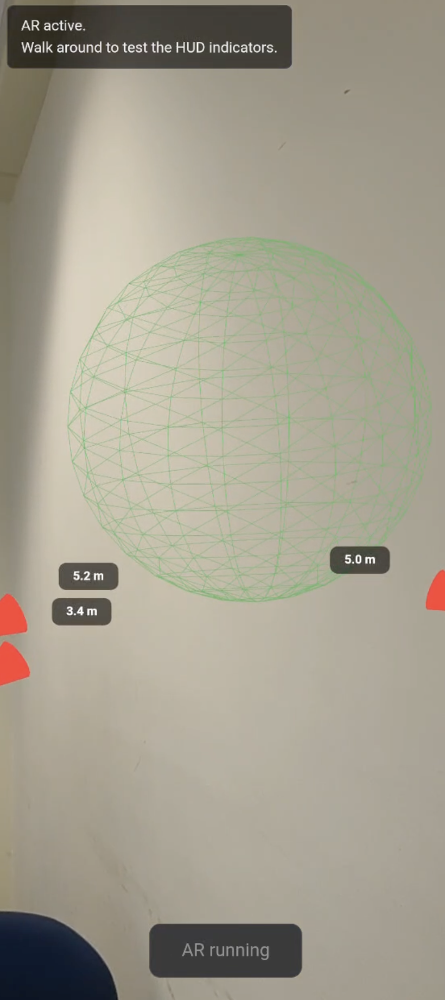
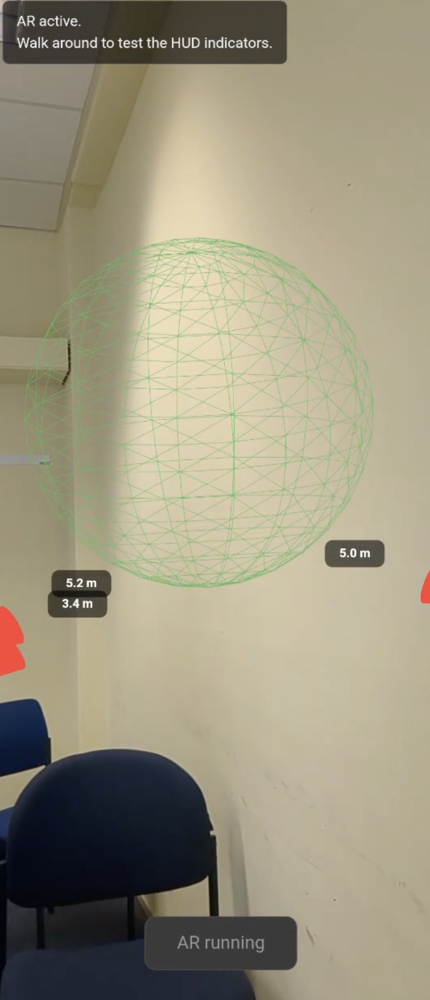
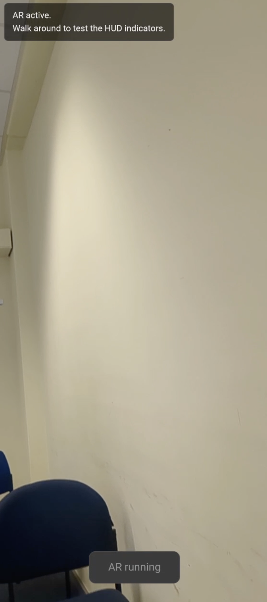

# SPP Task 2 Notes

## Prototype 1

### Problem 1 (Puffer zwischen Circleanzeige und Pfeilanzeige)

**Vorher:**

```typescript
const onScreen = !isBehind && Math.abs(ndc.x) <= 0.8 && Math.abs(ndc.y) <= 0.8;
```

**Lösung:**

```typescript
const onScreen = !isBehind && Math.abs(ndc.x) <= 1 && Math.abs(ndc.y) <= 1;
```

---

### Problem 2 (Aktuelle Berechnung durch NDC)

**Vorher:**

```typescript
const angle = Math.atan2(ndc.y, ndc.x);
```

**Lösung:**

```typescript
const physicalX = ndc.x * (frustumWidth / 2);
const physicalY = ndc.y * (frustumHeight / 2);
const angle = Math.atan2(physicalY, physicalX);
```



---

### Problem 3 (Folgefehler von Problem 2 – Circle verhält sich falsch)

Der Circle-Mechanismus wird definiert durch:

```typescript
if (onScreen && (distance >= DISTANCE_MAX || this.currentState === 'circle')) {
    this.currentState = 'circle';
    ...
}
```

Funktioniert nach der Änderung aus Problem 2 nicht mehr korrekt.

**Lösung:**

Da das Update zuvor über mehrere unabhängige `if`-Abfragen die States gewechselt hat, wurde `currentState === 'arrow'` immer priorisiert. Die Abfragen wurden deshalb zu einer `if`–`else if`-Struktur geändert.



---

### Problem 4 (Distanzparameter sind festgelegt)

**Vorher:**

```typescript
const DISTANCE_MAX = 20.0;
const DISTANCE_MIN = 18.0;
```

**Lösung:**

Der Konstruktor wurde erweitert:

```typescript
constructor(scene, camera, config) {

    // Fail fast: enforce explicit configuration to prevent unintended behavior
    if (!config || typeof config.distanceMin === 'undefined' || typeof config.distanceMax === 'undefined') {
        throw new Error(
            "ARWayfindingHUD initialization failed: A configuration object containing " +
            "'distanceMin' and 'distanceMax' is strictly required to define the spatial hysteresis."
        );
    }

    this.camera = camera;

    // Map the enforced configuration variables
    this.distanceMin = config.distanceMin;
    this.distanceMax = config.distanceMax;

    // HUD distance remains optional as it is purely visual, falling back to 2.5m
    this.hudDistance = config.hudDistance !== undefined ? config.hudDistance : 2.5;

    this.targetStates = [];

    // Bind HUD to the camera transform to keep indicators in view space.
    scene.add(this.camera);
}
```

---

### Problem 5 (Komponente funktioniert nicht mit mehreren Targets)

**Lösung:**

Jedes Target erhält nun ein eigenes Paar aus Pfeil und Kreis, welche jeweils in einem Array gespeichert werden. Dadurch überschreiben sich verschiedene Targets nicht mehr und besitzen ihren eigenen Kreis bzw. Pfeil.

---

### Problem 6 (Kreis wird zu lange angezeigt)

**Lösung:**

```typescript
const VIEWPORT_INNER = 1.0;
const VIEWPORT_OUTER = 1.05;

let onScreen = false;

if (!isBehind) {

    if (state.currentState === 'arrow') {

        // Wait until the pivot point explicitly enters the visible frame
        onScreen = Math.abs(ndc.x) <= VIEWPORT_INNER &&
                   Math.abs(ndc.y) <= VIEWPORT_INNER;

    } else {

        // Keep it "on-screen" until it is pushed definitively past the outer buffer zone
        onScreen = Math.abs(ndc.x) <= VIEWPORT_OUTER &&
                   Math.abs(ndc.y) <= VIEWPORT_OUTER;

    }

}
```



---

### Problem 7 (Inkonsistenz bei der Kreisanzeige durch Rotation)

**Lösung:**

Anpassung der `OrbitControls`, sodass sich die Kamera wie eine Free-Roam-Kamera verhält.

---

# Prototype 2

## Problem 8

Wenn man sich einem Objekt nähert, verschwindet der rote Kreis wie gewünscht. Entfernt man sich anschließend wieder, erscheint der Kreis jedoch nicht erneut, sondern erst nachdem das Objekt einmal aus dem Sichtfeld verschwunden und wieder sichtbar geworden ist.

### Objekt auf Distanz



### Objekt nah



### Objekt wieder auf Distanz



### Kann ebenfalls auftreten



**Vorher:**

```typescript
else if (state.currentState === 'arrow') {

    state.currentState = 'circle';

}
```

**Lösung:**

```typescript
else if (state.currentState !== 'circle') {

    state.currentState = 'circle';

}
```

---

## Problem 9 (Effizienz)

**Vorher:**

```typescript
renderer.setAnimationLoop(() => {

    if (hud) {

        hud.update(waypoints);

    }

    renderer.render(scene, camera);

});
```

Statt in jedem Frame alle Waypoints erneut zu übergeben, wird die HUD-Komponente um drei Funktionen erweitert. Dadurch werden Waypoints einmal initialisiert und anschließend nur noch gezielt hinzugefügt, aktualisiert oder entfernt.

```typescript
/**
 * Replace the entire waypoint list.
 * @param {THREE.Vector3[]} positions
 */
setWaypoints(positions) {

    this._waypoints = [...positions];

}

/**
 * Append a single waypoint.
 * @param {THREE.Vector3} position
 */
addWaypoint(position) {

    this._waypoints.push(position);

}

/**
 * Remove the waypoint at the given index.
 * @param {number} index
 */
removeWaypoint(index) {

    this._waypoints.splice(index, 1);

}
```